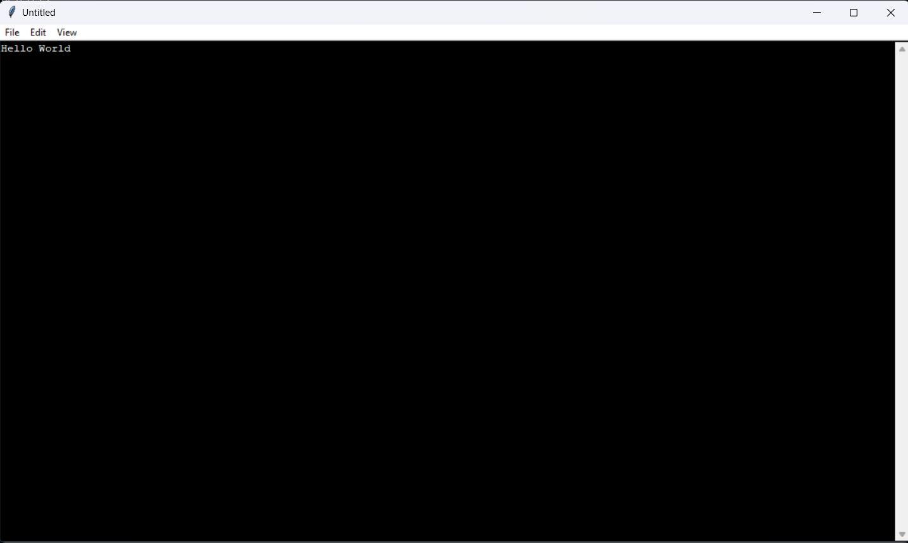
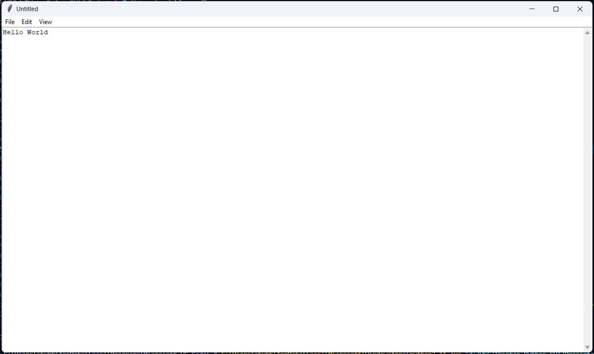

# Python Notepad (Text Editor)

A simple text editor built using Python's Tkinter library.  
This notepad application allows you to create, open, edit, and save text files.

## Features

- Create, open, edit, and save text files
- Simple and intuitive GUI using Tkinter
- Basic editing features: cut, copy, paste, undo, redo, select all, etc.
- Adjustable window size
- Switch between light and dark theme

## Getting Started

1. **Clone the repository:**
   ```bash
   git clone https://github.com/shubha-pandey/Notepad.git
   cd Notepad
   ```

2. **Run the notepad application:**
   ```bash
   python Notepad.py
   ```

## Screenshots

<!--
> **Tip:** Upload your screenshots to the repository (e.g., in a folder named `screenshots`) and update the image links below.
-->




## Requirements

- Python 3.x

Tkinter is included with most Python installations.

## License

This project is open source and available under the [MIT License](LICENSE).

---

Happy editing!
